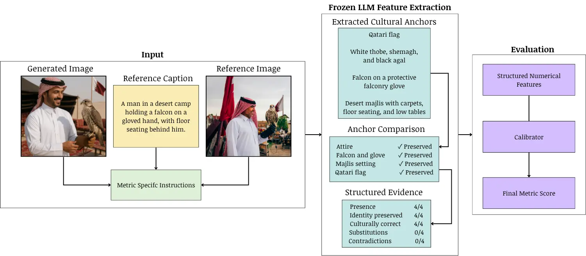

# DATALabKU at ImageEval 2026 Shared Tasks: Metric-Aware Cultural Evaluation for CRAI-Bench

This repository contains the evaluation notebooks for our ImageEval 2026 Task 2 system. The system evaluates culturally grounded text-to-image outputs from CRAI-Bench using a frozen multimodal GPT-5.4 model.

Instead of asking the model to produce only a final score, the proposed approach extracts structured cultural evidence from the reference image, caption, and generated image. The evidence is converted into metric-specific numerical features and mapped to CRAI scores using a lightweight regressor trained on the released task data.



## CRAI-Bench

Each sample contains a Qatari cultural reference image, an English caption, and a generated image. The dataset contains 200 instances derived from 40 reference images, with five caption versions per reference. The released data are divided into 120 training, 40 development, and 40 test instances.

The five evaluation dimensions are:

| Metric | Description | Composite weight |
|---|---|---:|
| CEA | Cultural Element Accuracy | 0.30 |
| CC | Contextual Coherence | 0.20 |
| CS | Cultural Specificity | 0.20 |
| CI | Cultural Integrity | 0.20 |
| HP | Hallucination Penalty | -0.10 |

The composite score is:

```text
CRAI = 0.30 CEA + 0.20 CC + 0.20 CS + 0.20 CI - 0.10 HP
```

## Method

The proposed framework follows four main stages:

1. GPT-5.4 identifies culturally important anchors from the reference image and caption.
2. Each anchor is compared with the generated image to detect preservation, substitution, contradiction, or cultural distortion.
3. The structured evidence is converted into metric-specific numerical features.
4. A lightweight regressor maps the features to the final CRAI metric score.

Ridge regression is selected using group-based cross-validation on the training set. Caption variants associated with the same reference image remain in the same fold to prevent closely related samples from appearing in both training and validation partitions.

The direct-scoring baseline instead asks the multimodal model to predict the target CRAI score directly from the reference image, generated image, and caption.

## Results

Development-set results reported in the paper are shown below. Spearman correlation is the primary metric and MAE is the secondary metric.

| Metric | Proposed Spearman | Direct Spearman | Proposed MAE | Direct MAE |
|---|---:|---:|---:|---:|
| CEA | 0.7732 | 0.6950 | 0.2303 | 0.2378 |
| CC | 0.7306 | 0.7352 | 0.2423 | 0.3368 |
| CI | 0.8276 | 0.7043 | 0.1583 | 0.2650 |
| CS | 0.7738 | 0.8184 | 0.1969 | 0.1745 |
| HP | 0.1188 | 0.1388 | 0.1563 | 0.1347 |
| Composite | **0.8241** | 0.7505 | 0.1943 | **0.1893** |
| Composite (test) | **0.8040** | - | **0.1415** | - |

The proposed approach improves composite development Spearman correlation, with its largest gains on CEA and CI. Direct scoring performs better on CS and HP and obtains a slightly lower composite development MAE. HP remains the most difficult dimension for both approaches. Direct-baseline test results were not reported because of computational constraints.

## Repository Structure

```text
Proposed_Method/
  ImageEval2026_Task2_CEA_Minimal.ipynb
  ImageEval2026_Task2_CC_Minimal.ipynb
  ImageEval2026_Task2_CI_Minimal.ipynb

Baseline/
  ImageEval2026_Task2_CEA_Direct_Fewshot_Baseline.ipynb
  ImageEval2026_Task2_CC_Direct_Evaluation.ipynb
  ImageEval2026_Task2_CI_Direct_Evaluation.ipynb
  ImageEval2026_Task2_CS_Direct_Evaluation.ipynb

assets/
  framework.webp
```

The repository currently contains the available proposed-method notebooks for CEA, CC, and CI and the available direct-baseline notebooks for CEA, CC, CI, and CS.

## Running the Notebooks

The notebooks are designed for Google Colab. Before running them:

1. Add an OpenAI API key to Colab Secrets using the name `openai`.
2. Upload the released CRAI-Bench data to Google Drive.
3. Update the project path in the configuration cell if your Drive structure differs.
4. Run the development stage before enabling test inference.

API inference may incur usage costs. The notebooks use resumable caches so interrupted runs can continue without repeating completed requests.

## Authors

- Lulwah AlKulaib
- Ahmed Jlidi

DATA Lab, Department of Computer Science, College of Science, Kuwait University.
